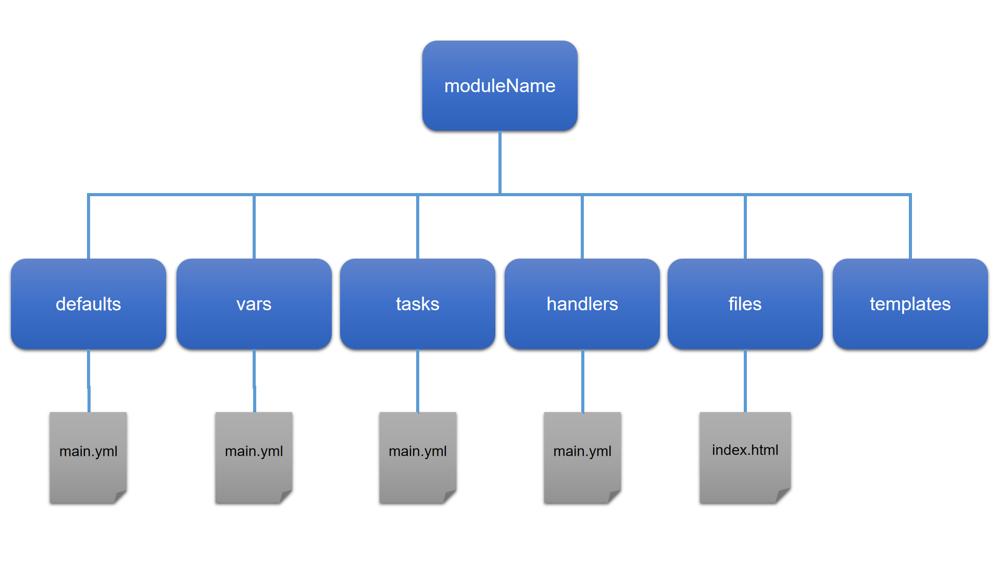

# Directory Structure

Reference: https://docs.ansible.com/ansible/latest/playbook_guide/playbooks_reuse_roles.html

Up to now we have dealt with the core of what's in a single playbook; the syntax, modules as well as conditions, loops and error handling.

At this stage we can write different playbooks for different system configurations, provisioning and deployments of software.  We know how to specify variables and how they can be overridden from the command line using **--extra-vars**.

What we don't have is the ability to manage sites and collections of different systems for our environments.

What if we need to manage different environments such as **development**, **UAT**, **productions**, and any others you may use?

It would be easier to manage our entire infrastructure through code if we could make changes through a project style Git repository.  This repository could be 1 big repository, or a collection of repositories, to allow different teams to manage their part of the infrastructure.

If we continued to use single playbooks we would need to construct multiple shell scripts to provide the necessary overrides for all of the variables, so it would be easier to manage variables through files in different directories.

It is also easier to manage playbooks when they are broken down into separate directories, allowing us to manage code simpler.  Take our **agnostic** playbook earlier.  It would be easier to have files for the specific operating systems, rather than trying to write them in one big file.  Playbooks written in the style we're about to look at also means we can re-use the playbook, but supply different variables to change the configuration, and use them in other sites.

The playbook method we are about to dive into is to write **roles**.

To bring many **roles** together and apply configuration through variable files to manage our servers is called a **site**.

## Single playbook to a role directory comparisson

Let's take a look at how a single playbook structure breaks down into a role structure.

Assuming the following skeleton playbook:

```yaml
- name: Skeleton playbook
  hosts:
    - development
  vars:
    var1: value 1
    var2: value 2
  tasks:
    - name: Install service
      ansible.builtin.package:
        name: someservice
        state: present
    - name: Copy a file
      ansible.builtin.copy:
        dest: /tmp/afile
        src: files/somefile
    - name: Config file
      ansible.builtin.template:
        src: templates/service.conf.j2
        dest: /etc/service.conf
      notify:
        - Restart service
  
  handlers:
    - name: Restart service
      ansible.builtin.systemd:
        name: service_name
        state: restarted
```

The directory structure for a role is:



It should be fairly easy to match the Ansible playbook to the directory structure.  Each directory matches a section in the playbook, such as **vars**, **tasks**, **handlers**, etc.  You will notice though that we also have a new directory called **defaults**.  This directory allows us to specify default variable values that can be overridden in the **vars** folder.

What we don't see is where the **hosts** section resides.  This is because we don't include **hosts** in our roles.  A role is a collection of all of these components that will provision/manage a software deployment, system configuration, etc.  For example, building an Apache web server, or creating and managing Jenkins.

In the next section we will convert our webservers.yml playbook into a role.